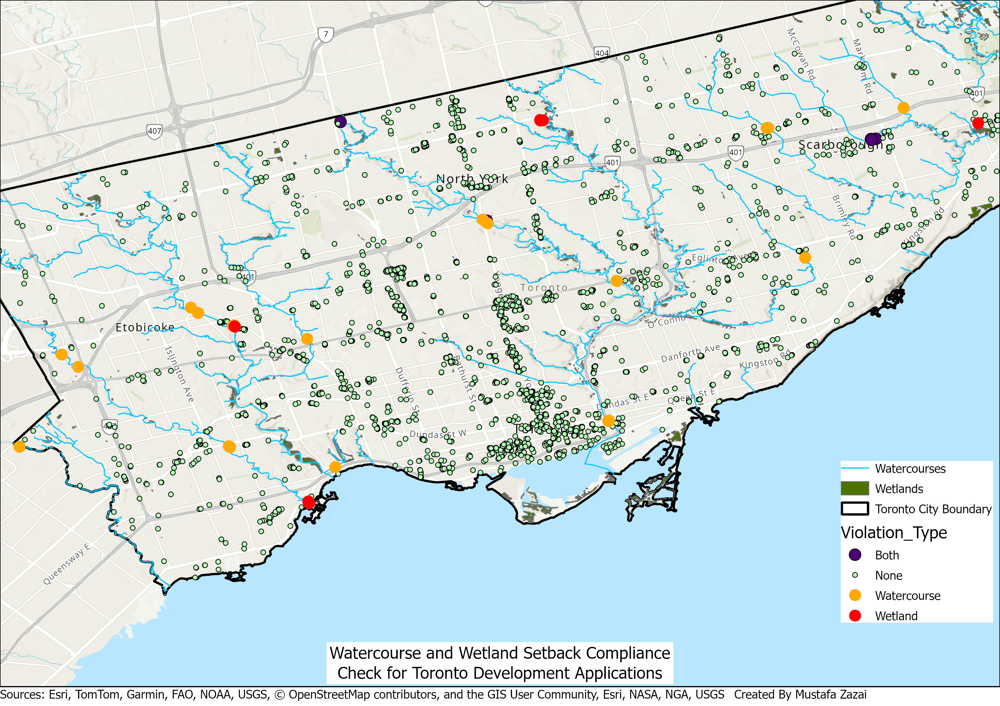

# Setback Compliance Checker

A Python/ArcPy automation tool built in ArcGIS Pro that checks proposed
development sites against regulatory setback distances from environmental
constraint layers (watercourses, wetlands), flags violations, and exports
a compliance report.

## Problem Statement
Checking whether proposed sites respect minimum setback distances from
sensitive environmental features is normally done manually, buffering
constraint layers and visually checking each site one at a time. This
doesn't scale past a handful of sites.

## What it does
1. Clips constraint layers and proposed sites to a study area boundary
2. Buffers watercourse and wetland layers by a user-defined setback distance
3. Checks every site against each buffer zone using SelectLayerByLocation
4. Flags violations per constraint (Watercourse / Wetland / Both / None)
5. Exports a compliance report as a table

## Data
- Watercourses & wetlands: Ontario GeoHub (geohub.lio.gov.on.ca)
- Proposed sites: City of Toronto Open Data — real Development
  Applications dataset (3,500+ real submitted planning applications),
  used for demonstration purposes. This tool performs a geometric
  setback check only; it does not replicate full regulatory review
  (application type, exemptions, etc. are not considered).

## Tools used
ArcGIS Pro, ArcPy — Clip, Buffer, SelectLayerByLocation, UpdateCursor,
dynamic script tool with GetParameterAsText.

## Sample result
Out of 3,518 real development applications checked against a 30m setback
in Toronto: **42 sites flagged for watercourse violations, 25 for wetland
violations.**

## How to run it
1. Add the script as a Script tool in an ArcGIS Pro toolbox
2. Configure 6 parameters (in order): Proposed Sites (Feature Layer),
   Study Area Boundary (Feature Layer), Watercourse Layer (Feature Layer),
   Wetland Layer (Feature Layer), Setback Distance (String, e.g. "30 Meters"),
   Output Table (Table, output)
3. Run the tool from the Geoprocessing pane, providing your own layers

## Viewing results
The tool outputs a table with `Watercourse_Viol`, `Wetland_Viol`,
`Overall_Status`, and `Violation_Type` fields. To visualize results on
a map after running the tool:
1. Add the output layer to your map
2. Right-click it → Symbology → set to **Unique Values**
3. Field = `Violation_Type`
4. Assign colors manually (e.g. green = None, orange = Watercourse,
   red = Wetland, purple = Both)

Symbology is not applied automatically — this is a manual step after
running the tool.

## Rerunning on a new study area
Swap the input layers (sites, boundary, watercourses, wetlands) for any
new dataset with matching geometry types — no code changes required,
since all inputs are parameterized.

## Limitations
- Demonstration project — not a substitute for actual regulatory review
- Only 2 constraint layers included; easily extendable to more
- Symbology must be manually configured after each run
